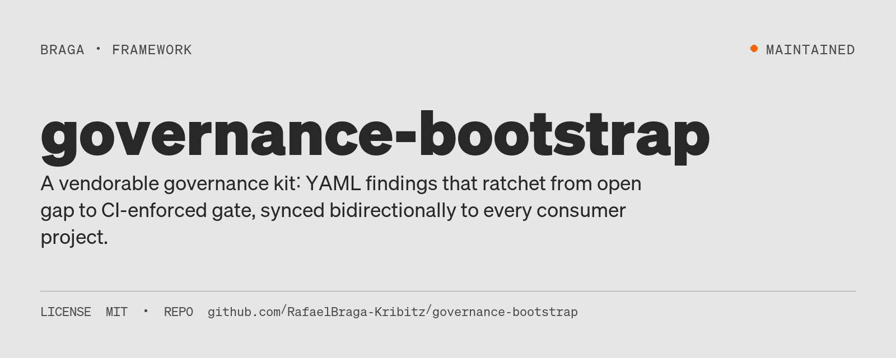
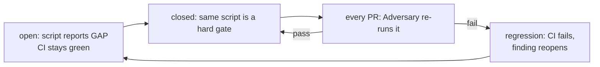
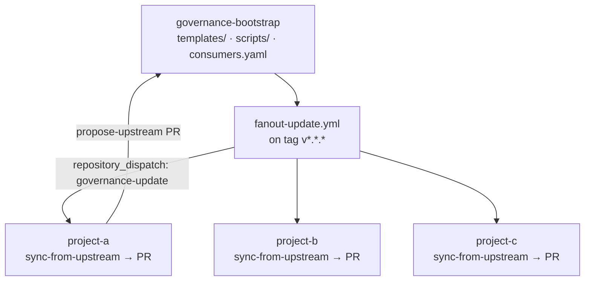

# governance-bootstrap



[](LICENSE)
[](#status)

**Status:** Maintained

LLM coding sessions invent a new audit, declare the work closed, and leave no machine-readable state. This kit turns each recurrence-prone problem into a YAML finding that ratchets from an open gap to a CI-enforced gate, then vendors that discipline into the projects that subscribe to it.



## The idea

Every recurrence-prone problem becomes a YAML file under `governance/findings/`. Each YAML names a `verification_script`. While the finding is `open` the script reports `[GAP]` and CI stays green; the moment status flips to `closed`, the same script becomes a hard CI gate — regressing it fails the PR and reopens the finding automatically.

Three roles operate the queue: the **Steward** (read state, regenerate the session handout), the **Remediator** (one finding per PR), and the **Adversary** (re-verifies every closed finding on every PR). The methodology is documented in `templates/AUDIT_PROCEDURE.md` and the agent protocol in `templates/CLAUDE.md`.

What gets gated out of the box:

| Gate | Script | Finding |
|---|---|---|
| Hardcoded values in `.py` | `check_hardcoded_values.py` | `F-HARDCODED-VALUES` |
| Hardcoded values in `.ipynb` | `check_notebook_values.py` | `F-NOTEBOOK-HARDCODED-VALUES` |
| Hardcoded values in `.sql` | `check_sql_values.py` | `F-SQL-HARDCODED-VALUES` |
| Parameter registry integrity | `check_parameter_registry.py` | `F-PARAMETER-REGISTRY-INCOMPLETE` |
| Orphan config keys | `check_config_orphans.py` | `F-CONFIG-ORPHANS` |
| Unresolved `config.X` refs | `check_config_references.py` | `F-CONFIG-REFERENCE-RESOLUTION` |
| Line + branch coverage | `check_test_coverage.py` | `F-COVERAGE-GAP` |
| Cyclomatic complexity | `check_complexity.py` | `F-COMPLEXITY-VIOLATION` |
| File + function line budgets | `check_module_sizes.py` | `F-MODULE-SIZE` |
| Dependency layer rules | `check_dependency_structure.py` | `F-DEPENDENCY-VIOLATION` |
| CRAP score (C²·(1−COV)³+C) | `check_crap_score.py` | `F-CRAP-SCORE` |

Thresholds live in `templates/config/quality_gates.yaml` and are themselves registered in `templates/config/parameter_registry.yaml`. `make baseline` discovers the project's current values; `make audit` enforces them.

## Explore this project

| Path | Start here |
|---|---|
| Fast path | [The idea](#the-idea) — the open → closed → CI-enforced ratchet |
| Deep path | [Architecture](#architecture) + [`CONSUMER_SETUP.md`](CONSUMER_SETUP.md) — how the kit vendors and stays in sync |

## Quick start

### Subscribe a new project (3 steps)

```bash
# 1. Vendor the kit
cd ~/code/project-a
git remote add gov-upstream https://github.com/RafaelBraga-Kribitz/governance-bootstrap.git
git fetch gov-upstream
git subtree add --prefix=governance/_kit gov-upstream main --squash

# 2. Drop the two sync workflows into your repo
cp governance/_kit/templates/.github/workflows/sync-from-upstream.yml .github/workflows/
cp governance/_kit/templates/.github/workflows/propose-upstream.yml   .github/workflows/

# 3. Add a fine-grained PAT as GOV_SYNC_TOKEN secret in your repo settings
#    (Contents: write, Pull requests: write on this repo + the hub repo)
gh secret set GOV_SYNC_TOKEN < /path/to/pat.txt
```

Then open a PR on **this** repo adding `project-a` to `consumers.yaml`.

Full walkthrough: [`CONSUMER_SETUP.md`](CONSUMER_SETUP.md).

### Bootstrap a project (Mode B)

Paste [`BOOTSTRAP_PROMPT.md`](BOOTSTRAP_PROMPT.md) into a Claude Code session inside the new project's directory and follow the prompts. No sync workflows. Good for one-off projects that do not need to stay current with the kit.

## Architecture

Two consumption modes. Mode A (vendored subtree) is the intended path; Mode B is a copy-once bootstrap.

```
project-a/                          Mode A — vendored (recommended)
├── governance/
│   ├── _kit/              ← vendored from this repo (subtree, squashed)
│   ├── findings/          ← project-specific, NOT synced
│   ├── adrs/
│   └── AUDIT_STATE.json
└── .github/workflows/
    ├── governance.yml
    ├── sync-from-upstream.yml      ← pulls
    └── propose-upstream.yml        ← pushes back
```



**Downstream (hub → consumers).** Merging a PR on `main` here and pushing a tag `vX.Y.Z` triggers `fanout-update.yml`, which sends a `repository_dispatch: governance-update` event to every project in `consumers.yaml`. Each consumer's `sync-from-upstream.yml` runs `git subtree pull --squash` against the tagged ref and opens a PR titled `Governance kit sync: <tag>` on its own `main` branch. The consumer's existing `governance.yml` CI runs against the PR. Merge to adopt.

**Upstream (any consumer → hub → other consumers).** A developer fixes a bug in `governance/_kit/scripts/check_x.py` while working in project A. After landing the fix locally, they run **Actions → Propose change to governance kit**, providing a PR title and motivation. `propose-upstream.yml` clones the hub, rsyncs the consumer's `_kit/` contents over the hub root, and opens a PR back here. Once reviewed and merged here → tag → fanout → projects B and C see a sync PR.

Every change to `main` should be tagged `vX.Y.Z` to trigger fanout. Until the first real release, manual `workflow_dispatch` of `fanout-update.yml` with `ref: main` is the way to push updates.

## Repository structure

```
.
├── BOOTSTRAP_PROMPT.md          ← master prompt for a fresh Claude Code session
├── consumers.yaml               ← registry of projects subscribed to updates
├── CONSUMER_SETUP.md            ← how to vendor + subscribe a project
├── .github/workflows/
│   └── fanout-update.yml        ← broadcasts releases to every consumer
└── templates/                   ← the kit itself (vendored by consumers)
    ├── CLAUDE.md                ← agent protocol
    ├── PROJECT_CHARTER.md       ← SSOT skeleton (≤200-line budget)
    ├── AUDIT_PROCEDURE.md       ← Steward / Remediator / Adversary
    ├── Makefile.governance      ← audit, verify, session-start, session-end, baseline
    ├── config/                  ← SSOT scaffolding + quality_gates.yaml
    ├── scripts/                 ← ratchet helpers and the Adversary
    ├── tests/governance/
    ├── governance/findings/     ← one YAML per recurrence invariant
    └── .github/workflows/       ← governance.yml + bidirectional sync
```

## Limitations

- This is a **vendored kit**, not a hosted service. Consumers must install the subtree, workflows, and `GOV_SYNC_TOKEN` themselves; nothing arrives by cloning this repo alone.
- Bidirectional sync depends on GitHub Actions, a fine-grained PAT, and an accurate `consumers.yaml`. A missing secret or an unregistered repo silently drops that consumer from fanout.
- Closing a finding without a passing `verification_script` is the failure mode the kit exists to prevent. The templates cannot stop a consumer from deleting the Adversary job or skipping `make verify`.
- Mode B (copy-once bootstrap) does not receive kit updates. Use Mode A if the project should stay on the ratchet.
- The kit encodes one methodology (`templates/AUDIT_PROCEDURE.md`). It does not score code quality on its own; it ratchets whatever gates the consumer baselines.

A consumer that never closes a finding, or that closes findings by editing YAML only, falsifies the claim that the kit is operating.

## Status

**Status:** Maintained

The hub, templates, fanout workflow, and first consumer (`decision-analytics-reconstruction`) are in place. Releases are still dispatched with `workflow_dispatch` on `fanout-update.yml` until the first `vX.Y.Z` tag.

Repository last updated 2026-09-16 (date of the last commit).

## License

MIT — see [`LICENSE`](LICENSE).

## Author

<table>
  <tr>
    <td width="110">
      
    </td>
    <td>
      <strong>Rafael Braga-Kribitz</strong><br />
      Seiersberg-Pirka, Austria · Portfolio project, 2026<br />
      <a href="https://www.linkedin.com/in/rafaelbragakribitz/">LinkedIn</a>
      ·
      <a href="mailto:rafaelbragakribitz@gmail.com">rafaelbragakribitz@gmail.com</a>
    </td>
  </tr>
</table>
